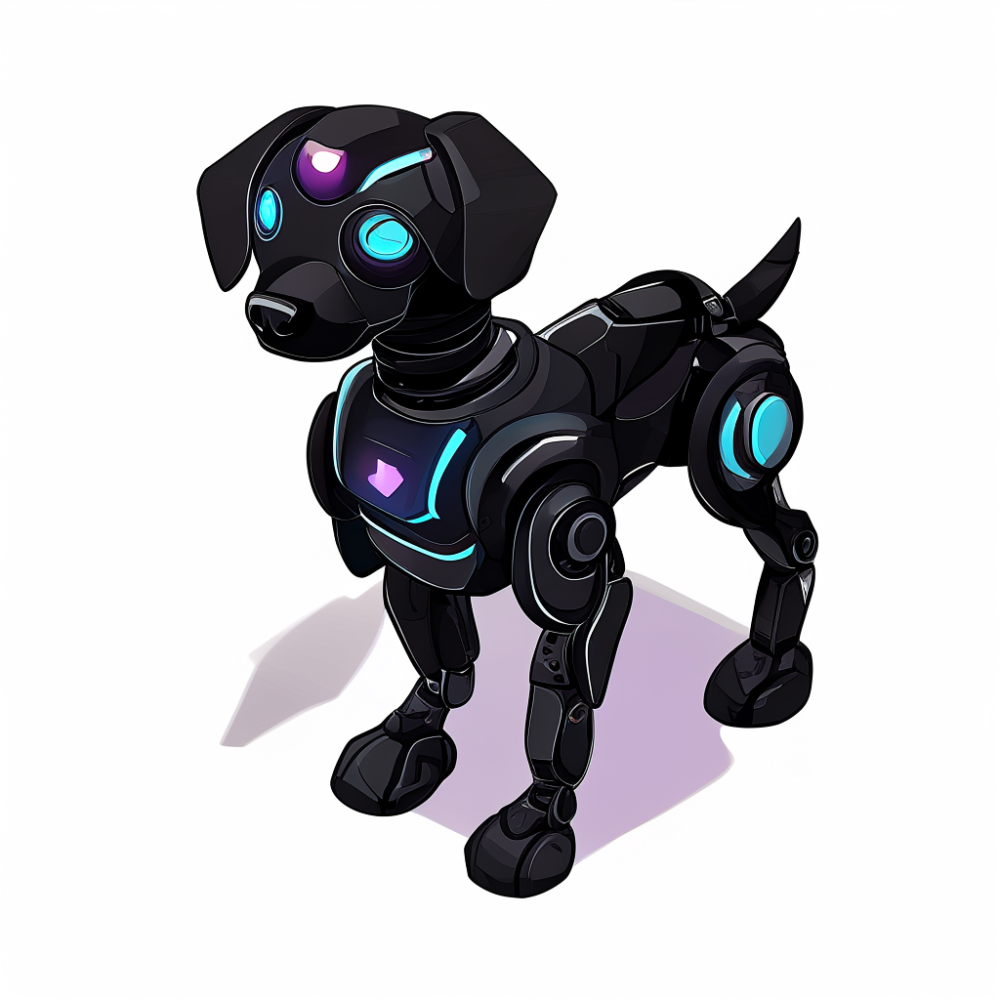

# 🧠 Diffusion 기반 3D 객체 생성기


본 프로젝트는 **Stable Diffusion 기반 이미지 생성**과 **Image-to-3D (InstantMesh)**를 활용하여 텍스트 프롬프트로부터 3D 객체를 자동 생성하는 AI 콘텐츠 생성 도구입니다.

---

## ✨ 주요 기능

### 🎨 1. Text-to-Image
텍스트 프롬프트를 입력하면 **Stable Diffusion**을 통해 컨셉 이미지를 생성합니다.

| 프롬프트 | 생성 이미지 |
|----------|-------------|
| `a futuristic robot dog,black, isometric, white background` |  |
| `"a cup of coffee, white background"` |  |

---

### 🧱 2. 이미지 기반 3D 객체 복원
분리된 객체 이미지를 **Image-to-3D** 기술(InstantMesh)에 입력하여 3D Mesh(.obj)를 자동 생성합니다.

| 입력 이미지 | 복원된 3D 모델 |
|-------------|----------------|
|  |  |

---

## ⚙️ 설치 및 실행

```bash
git clone https://github.com/username/diffusion-3d-generator.git
cd diffusion-3d-generator
pip install -r requirements.txt
python app.py
