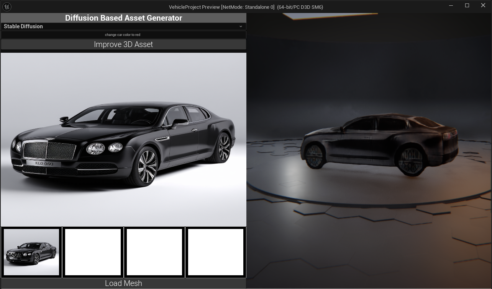
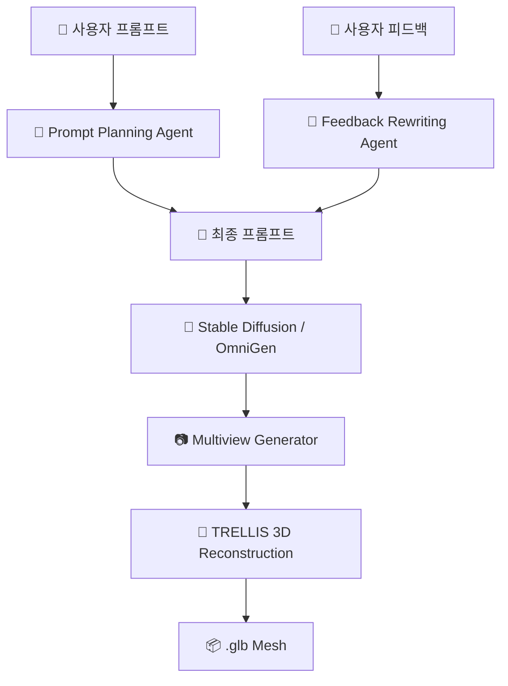

# Prompt2Drive - Diffusion, Image to 3D 모델을 활용한 3D Asset 생성기

//

본 프로젝트는 **Stable Diffusion 3 기반 이미지 생성**과 **Image-to-3D **를 활용하여 텍스트 프롬프트로부터 3D 객체를 자동 생성하는 AI 콘텐츠 생성 도구입니다.

---
## 🔧 주요 기능

- **프롬프트/이미지 기반 3D 생성**: Stable Diffusion 3, OmniGen, GPT-4o를 활용한 의미 보존 기반 프롬프트 리라이팅
- **멀티뷰 기반 메시 생성**: InstantMesh 또는 TRELLIS 기반 메쉬 재구성
- **`.glb` 포맷 출력**: Unreal Engine 클라이언트에서 실시간 메쉬 생성 파이프라인 호출
- **Unreal Engine 연동**: C++에서 HTTP 요청을 통해 생성 요청 및 실시간 메시 임포트

## 🧠 사용된 AI 모델

| 단계 | 모델/기술 |
|------|-----------|
| 텍스트 기반 이미지 생성 | Stable Diffusion 3, OmniGen |
| 피드백 기반 프롬프트 리라이팅 | OpenAI GPT-4o |
| 멀티뷰 투시 이미지 생성 | Custom MVS Generator |
| 메시 복원 | InstantMesh, TRELLIS |
| 실시간 메시 표현 | Unreal Engine GLTF Loader (Custom UI 포함) |

## LLM 기반 Agent 시스템 구성
LLM(gpt-4o)은 사용자 프롬프트를 해석하고, 시각적 목표와 피드백을 기반으로 **3D 생성 파이프라인을 지능적으로 제어**하는 역할을 수행합니다. 이 LLM 파트는 크게 3가지 Agent로 구성됩니다.

### 🔹 1. Prompt Planning Agent
* 사용자 입력 프롬프트를 분석하여 구조화된 문장으로 변환
* 모호한 묘사를 세분화하여 이미지 생성 품질 향상

### 🔹 2. Feedback Rewriting Agent
* 사용자 피드백을 수용하여 기존 프롬프트를 개선
* "로고를 추가해줘" → "visible brand logo on the front bumper"

### 🔹 3. Visual Goal Generator (예정)
* 시각적 목표 (객체 수, 행동, 스타일 등)를 구조화하여 생성 흐름 자동 제어

### 🔄 전체 흐름도 (Mermaid)

---

## 🕹 Unreal Engine 연동

- `AServerRequestActor` 클래스를 통해 C++ 코드에서 HTTP 요청 전송
- `RequestMeshGeneration(prompt, model)` 함수 호출 → FastAPI로 메쉬 생성 요청
- 생성된 `.glb` 파일은 `FHttpModule` 기반 HTTP 요청으로 다운로드
- 다운받은 `.glb`는 GLTF 로더를 통해 런타임에 임포트 및 Viewport에서 표시
- 실시간 피드백을 반영한 리제너레이션 기능 (`/feedback_rewrite` 엔드포인트 사용)

## 🧩 API 엔드포인트 요약

| 메서드 | 경로 | 설명 |
|--------|------|------|
| POST | `/generate/` | 프롬프트와 모델명을 입력받아 백그라운드에서 3D 생성 시작 |
| GET  | `/glb/{uuid}` | 생성된 `.glb` 메시 파일 다운로드 |
| GET  | `/image/{uuid}/{type}` | 생성된 이미지(`gen`, `mvs`) 반환 |
| POST | `/feedback_rewrite` | GPT-4o 기반 프롬프트 개선 후 3D 재생성 실행 |

