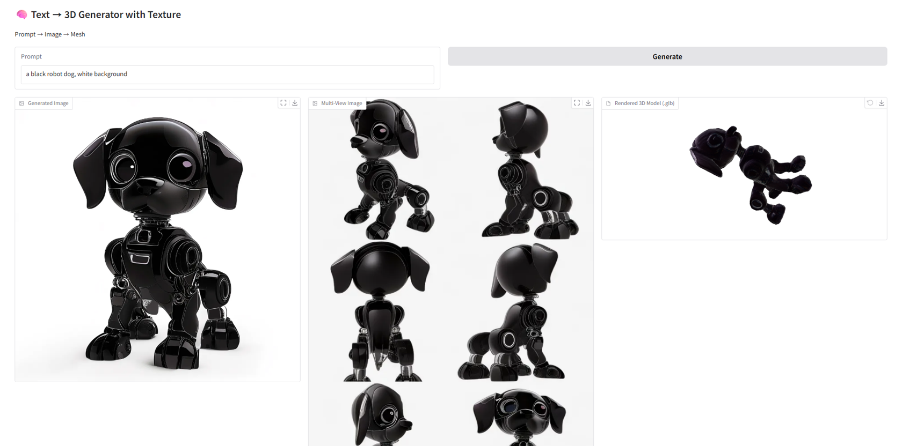

# Prompt2GLB - Diffusion, Image to 3D 모델을 활용한 실시간 3D Asset 생성기

//

본 프로젝트는 **Stable Diffusion 3 기반 이미지 생성**과 **Image-to-3D **를 활용하여 텍스트 프롬프트로부터 3D 객체를 자동 생성하는 AI 콘텐츠 생성 도구입니다.

---
## 🔧 주요 기능

- **프롬프트/이미지 기반 3D 생성**: Stable Diffusion 3, OmniGen, GPT-4o를 활용한 의미 보존 기반 프롬프트 리라이팅
- **멀티뷰 기반 메시 생성**: InstantMesh 또는 TRELLIS 기반 복셀 재구성
- **후처리 지원**: 메시 단순화, 홀필링, UV 언랩핑, 텍스처 투사
- **`.glb` 포맷 출력**: Unreal Engine 및 웹 뷰어 호환
- **Unreal Engine 연동**: C++에서 HTTP 요청을 통해 생성 요청 및 실시간 메시 임포트

## 🧠 사용된 AI 모델

| 단계 | 모델/기술 |
|------|-----------|
| 텍스트 기반 이미지 생성 | Stable Diffusion 3, OmniGen |
| 피드백 기반 프롬프트 리라이팅 | OpenAI GPT-4o |
| 멀티뷰 투시 이미지 생성 | Custom MVS Generator |
| 메시 복원 | InstantMesh, TRELLIS |
| 실시간 메시 표현 | Unreal Engine GLTF Loader (Custom UI 포함) |

## 🕹 Unreal Engine 연동

- `AServerRequestActor` 클래스를 통해 C++ 코드에서 HTTP 요청 전송
- `RequestMeshGeneration(prompt, model)` 함수 호출 → FastAPI로 메쉬 생성 요청
- 생성된 `.glb` 파일은 `FHttpModule` 기반 HTTP 요청으로 다운로드
- 다운받은 `.glb`는 GLTF 로더를 통해 런타임에 임포트 및 Viewport에서 표시
- 실시간 피드백을 반영한 리제너레이션 기능 (`/feedback_rewrite` 엔드포인트 사용)

## 🧩 API 엔드포인트 요약

| 메서드 | 경로 | 설명 |
|--------|------|------|
| POST | `/generate/` | 프롬프트와 모델명을 입력받아 백그라운드에서 3D 생성 시작 |
| GET  | `/glb/{uuid}` | 생성된 `.glb` 메시 파일 다운로드 |
| GET  | `/image/{uuid}/{type}` | 생성된 이미지(`gen`, `mvs`) 반환 |
| POST | `/feedback_rewrite` | GPT-4o 기반 프롬프트 개선 후 3D 재생성 실행 |

## 🛠 설치 및 실행

### 요구사항
- Python 3.10+
- CUDA 지원 GPU
- `conda` 또는 `venv` 환경 권장
- Unreal Engine 5 (클라이언트 연동 시)
